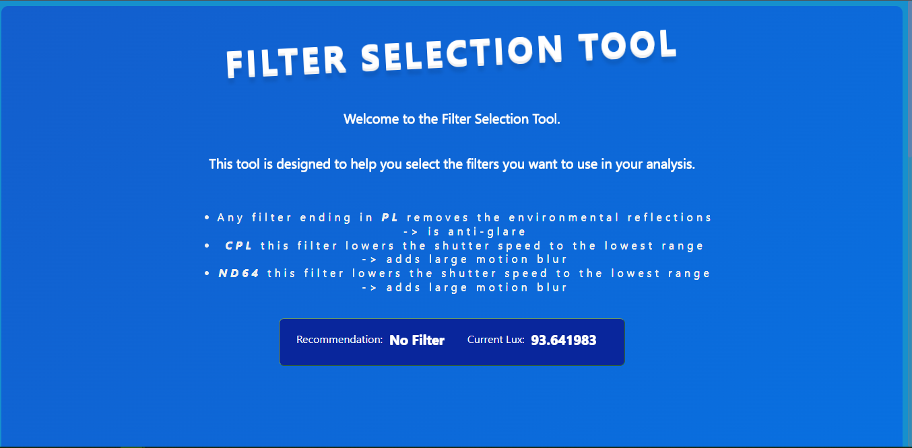

# ND_Filter_Cordova_App

This is a Cordova app that listens to data from the phones built-in Lux sensor for selecting the right Optical Lens filter.

This project is a simple spin-off of my [ESP32 device](https://github.com/ZanzyTHEbar/ND_Filter_Selection) that can be used to select the right filter for your camera sensor.

The inspiration for this project came about as i needed an automated way to select the right filter for my [Parrot Anafi](https://www.parrot.com/en/drones/anafi), based on environmental conditions.

This project uses a very simple algorithm to select the right filter, input data is collected using an `LDR sensor` and the filter is selected based on the average value of the input relative to a known `Lux` map of sunlight values. It is not the most accurate thing in the world, but is accurate enough to be useful for amateur cinematography.

To setup the project, you need to install the following packages:

- [VSCode](https://code.visualstudio.com/download)
- [NodeJS + NPM](https://nodejs.org/en/)
- [Cordova](https://cordova.apache.org/docs/en/latest/guide/cli/)

You then need to plug your phone (only Android support at the moment) into your PC and run the following commands.

    cordova build android
    cordova run android

If you have any issues, please open an issue. If you have any questions, please ask in the discussions section.

